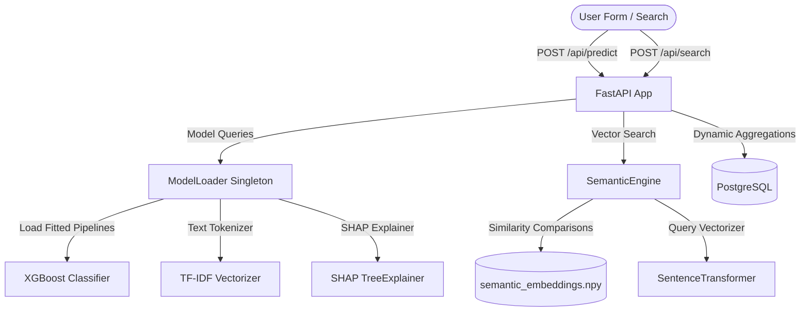

# AutoSentinel AI — Explainable Automotive Recall Intelligence Platform

AutoSentinel AI is a production-grade safety intelligence platform designed to ingest, process, assess, and analyze automotive safety recalls. By combining machine learning, natural language processing, and explainable AI (SHAP), AutoSentinel AI helps engineers and regulators predict recall risk tiers, generate automated safety headlines, and trace the exact textual and categorical triggers behind a vehicle defect.

---

## 🛠️ Technology Stack

### Backend
- **Core**: Python 3.10+, FastAPI (Asynchronous REST API)
- **Database**: PostgreSQL (Relational storage and metrics)
- **ORM**: SQLAlchemy (Declarative mapping and bulk operations)

### Machine Learning & NLP
- **Classifier**: XGBoost (Extreme Gradient Boosting Classifier)
- **Explainability**: SHAP (Shapley Additive exPlanations TreeExplainer)
- **Feature Extraction**: Scikit-Learn (TF-IDF Text Vectorization, One-Hot ColumnTransformer)
- **NER / Extraction**: SpaCy (`en_core_web_sm` token keyword-entity tagger)
- **Summarization**: HuggingFace Transformers (BART-Large-CNN with custom fallback)
- **Semantic Vector Space**: SentenceTransformers (`all-MiniLM-L6-v2` query vectorizer)

### Frontend
- **Framework**: React 18 (Vite-bundler)
- **Styling**: Tailwind CSS (Premium zinc dark-glassmorphism theme)
- **Data Visualizations**: Recharts (Responsive bar, pie, and line graphs)
- **Iconography**: Lucide React (Crisp modern vectors)

### Infrastructure
- **Containerization**: Docker (Multi-stage build layers)
- **Orchestration**: Docker Compose (Database, Backend, and Frontend Nginx)

---

## 🏗️ System Architecture

AutoSentinel AI utilizes a dual-engine architecture:
1. **Predictive Engine**: An input safety defect goes through standard feature cleaning, gets combined text vectorized (TF-IDF), transforms categorical and numeric dimensions, predicts class probabilities using XGBoost, and generates live feature contribution trace maps using a custom TreeExplainer SHAP engine.
2. **Semantic Engine**: Uses `all-MiniLM-L6-v2` dense embeddings generated over recall defective summaries. Incoming natural language queries are vectorized and compared using cosine-similarity to locate the most similar archived defect campaigns, mapping indexes back to PostgreSQL records dynamically.



---

## 📦 Getting Started

### Prerequisites
- Docker and Docker Compose installed.
- Python 3.10+ (if running the pipeline locally).

### Step 1: Preprocess Data & Train ML Core
Before starting the servers, you must run the data preprocessing and machine learning training pipeline to generate the serialized pipeline components, model parameters, and dense embeddings.

From the project root directory, run:
```bash
# Activate your virtual environment and install requirements
.venv\Scripts\activate
pip install -r requirements.txt

# Download required SpaCy model
python -m spacy download en_core_web_sm

# Execute full pipeline
python src/run_pipeline.py
```
This script will ingest the raw NHTSA safety recall CSV, clean features, engineer keyword columns, run predictions, fit the XGBoost classifier, calculate sample SHAP values, precompute SentenceTransformer embeddings, and serialize everything to the flat `artifacts/` folder:
- `artifacts/xgboost_model.pkl` (Fitted classifier)
- `artifacts/label_encoder.pkl` (Class labels)
- `artifacts/tfidf_vectorizer.pkl` (TF-IDF vectorizer)
- `artifacts/structured_preprocessor.pkl` (Column preprocessor)
- `artifacts/semantic_embeddings.npy` (Compiled dense embeddings)
- `artifacts/metadata.json` (Pipeline parameters)

---

### Step 2: Spin Up Containers (Docker Compose)
Once the artifacts exist, launch the orchestrated Docker environment:
```bash
docker-compose up --build
```

This will bootstrap the following:
1. **`db` (PostgreSQL)**: Runs a Postgres 15 database container.
2. **`backend` (FastAPI)**: Connects to the database, automatically initializes schemas, bulk-ingests the `ml_ready_vehicle_recalls.csv` on first startup, loads the ML models into RAM, and starts the API server on `http://localhost:8000`.
3. **`frontend` (React + Nginx)**: Compiles the React + Tailwind project and serves it through a high-performance Nginx server on `http://localhost`. It configures Nginx to reverse proxy any `/api/*` traffic directly to the backend container to prevent CORS issues.

Open **`http://localhost`** in your browser to experience the AutoSentinel AI platform!

---

## 🔌 API Documentation

Detailed REST API endpoints provided:

### 1. Assessment Predictor: `POST /api/predict`
Executes real-time safety recall threat classification.
- **Request Body**:
  ```json
  {
    "manufacturer": "Tesla",
    "component": "Brakes",
    "summary": "The brake pedal may feel sticky and fail to return to resting position.",
    "consequence": "A sticky brake pedal may increase stopping distances, increasing crash risk.",
    "remedy": "Dealers will replace the brake pedal assembly free of charge.",
    "model_year": 2021
  }
  ```
- **Response Structure**: Returns risk level probabilities, an AI-summarized headline (BART model), SpaCy extracted component and failure entity badges, and absolute SHAP feature contributions explaining the model's prediction.

### 2. Brands Rankings: `GET /api/manufacturers`
Aggregates and computes dynamic brand metrics.
- **Response**: Returns a ranked list of manufacturers ordered by our custom weighted **Safety Risk Index**, which balances recall volumes and severity ratios using a logarithmic decay function.

### 3. Vector Recall Search: `POST /api/search`
Retrieves historical safety recalls using vector similarity.
- **Request Body**:
  ```json
  {
    "query": "battery fire risk during charging",
    "top_k": 5
  }
  ```
- **Response**: Returns the most semantically related historical recalls matching the query, with color-coded risk levels, cosine-similarity scores, and detailed hazard logs.
